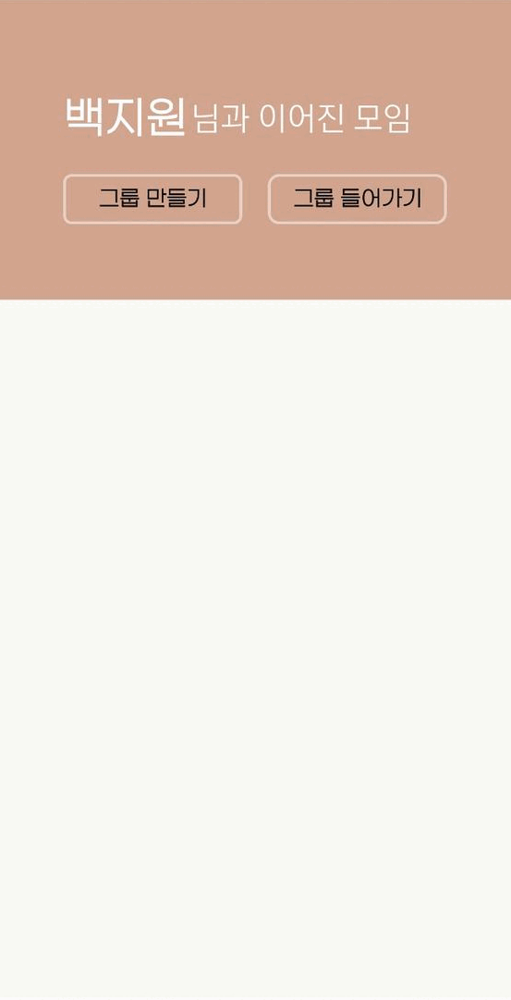
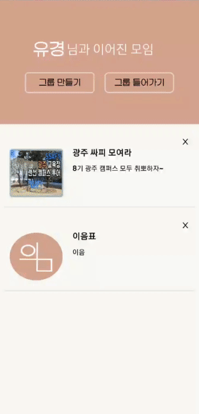
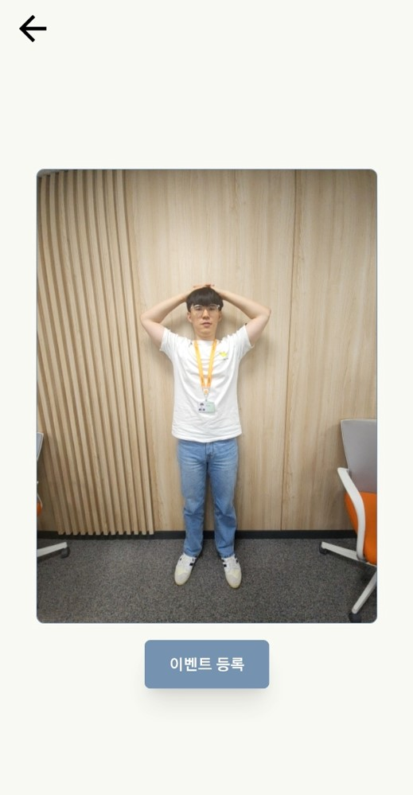
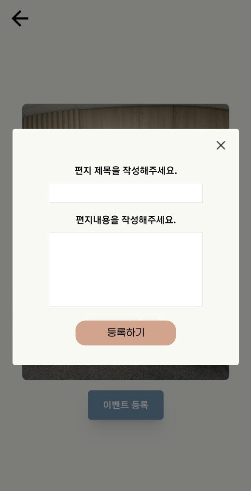

# 이음
## 주제
사용자가 시간적인 제한에서 벗어나 가족과 함께 여행을 할 수 있는 '이음'서비스입니다.

## 개발 기간
2023.04.10 ~ 2023.05.18 (6주)

## 팀원
6명(프론트 3명, 백앤드 2명, 안드로이드 스튜디오 1명)

## 주요 기술 스택

### FrontEnd
react : 18.2.0
next : 13.3.0
typescript : 5.0.4
redux-toolkit : 1.9.5
tanstack/react-query : 4.29.5

### BackEnd
Back-End : Java 11 / Springboot 2.7.10 / Gradle 7.6.1 / QueryDSL 5.0.0 / WebSocket 2.7.10 / Python 3.7.9 / FastAPI 0.95.1

### Android
Android 13 API 33

### Deploy
Docker, Jenkins, Nginx, AWS CloudFront, AWS S3, AWS Ec2

### 기능
- 사용자는 Spring Security를 이용한 Kakao 소셜 로그인을 할 수 있습니다.
- 사용자는 Group을 만들 수 있습니다.
- 사용자는 Group 코드를 통해 그룹에 참여할 수 있습니다.
- 사용자는 지도에서 이벤트를 등록할 수 있습니다. 
- - 이벤트 : 함께찍기(에이징/디에이징), 동작 따라 찍기가 있습니다.
- Group에 있는 다른 사용자는 등록된 이벤트를 수행할 수 있습니다.
- 함께찍기 이벤트를 수행할 때 등록된 사진과 이벤트를 하는 사용자의 사진을 합성할 수 있습니다.

### 와이어 프레임

### API 설계
#### User 

#### Group

#### Pin

### ERD 설계

### 프로젝트 폴더 구조
#### BackEnd
#### FrontEnd
#### Android
### 실제 서비스 화면
#### 메인 페이지

#### 그룹

#### 지도

#### 따라하기 이벤트

#### 함께찍기(에이징/디에이징) 이벤트

#### 이벤트 사진 꾸미기

#### 알림 기능

#### AR 길찾기 기능

#### 카카오톡 공유하기

