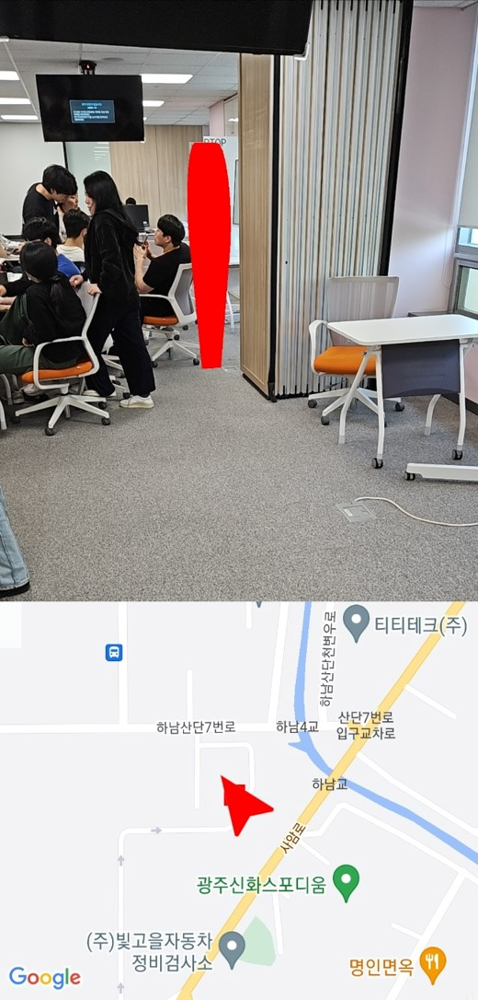

# 이음

> ## 주제  
>
> 바쁜 현대사회에서 가족과 함께 여행을 하지 못하는 사회에서 **시간과 공간의 제약에서 벗어나** 추억을 계속 이어줄 수 있는 이음 서비스입니다.  
>
> 
2023.04.10 ~ 2023.05.18 (6주)

  

> ## **Stacks**

#### **FrontEnd**

 

#### **BackEnd**

 

#### **Android**

 

#### **Deploy(CI/CD)**

 

#### **Communication Tools**

 

> ## 와이어 프레임

> ## API 설계도

#### **User**

#### **Group**

#### **Pin**

  

> ## ERD 설계

  

> ## 기능 소개

### **메인 페이지**

👀 '이음'서비스는 웹사이트와 모바일에서 각각 다른 화면을 보여주는 반응형 페이지를 만들었습니다:)
 

 

### **그룹**

👀 고유한 그룹코도를 가진 사용자들만이 그룹에 들어갈 수 있어요.

 

### **지도**

👀 모든 이벤트들은 지도에 있는 핀에서 확인할 수 있답니다

 

### **따라하기 이벤트**

👀사용자는 이미 등록되어 있는 이벤트 사진과 같은 포즈를 취함으로써 재미있는 추억을 공유할 수 있어요.

 

### **함께찍기(에이징/디에이징) 이벤트**

👀에이징효과로 부모님은 젊은 시절로, 자식들은 부모님과 같은세대의 자신의 모습을 볼 수 있답니다.

 

### **이벤트 사진 꾸미기**

👀이렇게 함께 찍은 사진은 부모님과 자식이 함께 사진을 꾸며 고유한 사진을 저장할 수 있게 되죠

 

### **알림 기능**

👀모바일 알림을 통해 사용자들은 즉각적인 알림을 확인할 수 있게 돼요

 

### **AR 길찾기 기능**

👀사용자들이 메시지를 쉽게 찾을 수 있도록 AR이 길을 안내해줘요.

 

### **카카오톡 공유하기**

👀사용자들은 함께 꾸민 사진을 카카오톡 공유하기를 통해 보냄으로써 추억을 저장할 수 있어요.

 

> ## 기대효과

### 🎉 지역경제 활성화  

지역 기반 편지 남기기 기능을 통해 국내여행을 증가시켜 지역 경제 활성화를 할 수 있습니다.

### 🎉 가족간 소통

서로 다른 세대를 공유하고 함께 찍고 꾸미는 기능을 통해 가족간의 소통을 높여줄 수 있습니다.

### 🎉 삶의 활력 회복  

'빈둥지 증후군'을 겪고 있는 부모님이 우울증으로 나아가지 않도록 삶의 활력을 높여줄 수 있습니다.

 

> ## 팀원소개
>
> #### BE(2명) FE(3명) Android(1명)

| 정원재 | 최지성 | 백지원  | 양동민 | 최유경 | 나혜승 |
| :----: | :----: | :-----: | :----: | :----: | :----: |
| 👑 BE  |   BE   | Android |   FE   |   FE   |   FE   |
