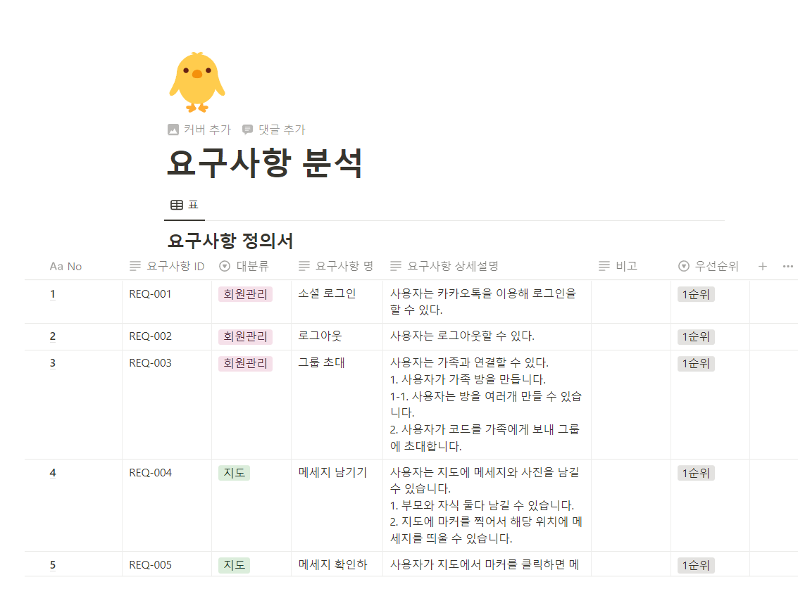

### 4월 11일 아이디어 회의
> 마약 중독 치료

기획배경

최근 한국에서 마약을 많이 하고있지만 마땅한 치료 사이트가 없습니다.

참조 마약치료 해외 사이트

[Drug Assistance Programs | AAFA.org](https://aafa.org/advocacy/advocacy-resources/patient-assistance-medicine-drug-programs/)

마약 중독의 경우 치료 방법으로 중독이 있는 장소를 피하는 것이라고 합니다.

때문에 마약을 한 장소에 다시 방문했을 때 알람을 울려 해당 장소를 피할 수 있도록 도와주는 서비스를 제공하려 합니다.

피드백
- 기획배경이 참 좋습니다.
- 상담센터와 연결해서 마약을 지양합니다.
- 기획보다는 기술이 필요해요. 우린 개발자니까요.

### 4월 12일 아이디어 회의
# 이음

조언을 주는 프로젝트

## 기획배경

예를 들어 워랜버핏이 조언을 하면 그 조언을 듣기 위해 해당 지역까지 가지 않을까??

글을 적는 사람의 유입을 위해 미래와의 소통….? 나 자신과 잇는 기능….

처음에 관심사나 기분을 체크할 수 있어야 함

관련된 글을 계속 나오게 함

그냥 SNS 사이트 느낌으로 가는게 좋지 않을까

### 컨셉

컨셉을 잡고 가자

편지 컨셉

### 기능

- 우표를 붙이자
- 편지에 음악을 추가할 수 있습니다.
- 편지 컬렉션
- 미래의 나에게 조언해주기
    - 늙었을 때 나의 사진을 보면서 나에게 조언 또는 칭찬을 해줍니다.
        - 고생했어 열심히 살았어 지금이면 아이들도 있고 좋은 가족이 있겠지?? …. 이런 느낌??
        - 더 열심히 살았어야지..?
- 익명의 사람들에게 조언을 얻기
    - 익명의 누군가가 글을 적으면 여러개가 사용자에게 뜨게 되는데 매일 하나씩 확인할 수 있습니다.
- 여러번 공감한 사람에게 편지를 제공합니다.
    - 고마운 마음을 담아(목소리 또는 텍스트) 편지를 제공합니다.
    - 고맙다는 편지를 보낼 때 공감한 편지들을 다시 제공해주는게 좋을까??
- 다이어리에 편지를 붙일 수 있습니다.
    - 붙인 편지에 나의 생각을 적을 수 있습니다.
- 내가 관심있는 태그를 설정할 수 있습니다.
    - 관심있는 태그의 편지를 받을 수 있습니다.

### 4월 13일 아이디어 회의
### 주제

부모 자식의 여행

친구들과의 여행

### 기획배경

바빠서 같이 여행을 못가는 경우가 있습니다.

바쁘다 바빠 현대사회

따로 여행을 가도 함께 여행을 간듯한 효과를 주자

프레임을 꾸밀 수 있도록 하여 더 예쁜 디자인을 제공하자

### 기능

- 편지를 좌표에 남길 수 있습니다.

그 부모님이 여행가는 길에 메시지를 남기는 거에서 더 디벨롭햇는데 길에 메시지도 남기고 우리의 사진도 남겨두는것임

인생네컷 아이돌 버전을 아십니까?

아이돌이 프레임에 들어가있어서 마치 아이돌과 같이 사진을 찍는것처럼 연출할 수 있는데

여기에 우리 사진을 넣는겁니다

그래서 누가 쓰느냐?

우리의 ‘부모님’

기존의 인생네컷(과 기타유사사진서비스들)은 기기가 있지 않으면 사진을 못찍었습니다

부모님들이 여행을 가서 사진을 남기는데 솔직히 그런데에 인생네컷과 같은 서비스는 없었을 것임

그리고 부모님들과 인생네컷 솔직히 안찍어봤을것..

ar로 가면이나 머리띠를 씌워주고 마치 자식과 함께 여행을 하는듯한 느낌을 주는 거임

그리고 공유하기 버튼을 줘서 부모님세대에 바이럴까지~~

바빠서 같이 못가는 자식들 ok 그냥 여행가기 귀찮은 자식들 ok

그냥 부모님 타겟팅안하고 친구들끼리도 ok~

### 4월 14일 아이디어 회의
      
요규사항 분석

